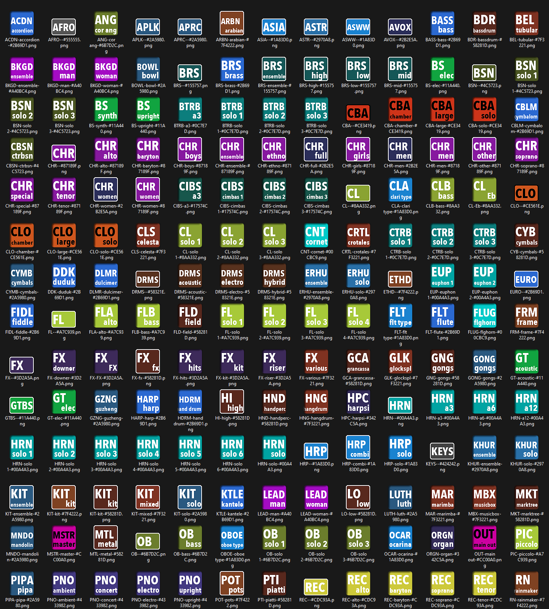

# DAWIconsGenerator

Icons Generator for DAWs using Python 3

September 2023, v1.0.0
by Loïc Desjardins, loic.desjardins@me.com

This script creates a set of icons according to the settings and list in tracks.json
These icons are espcially for use with DAW : Logic Pro, Cubase, Studio One, Reaper and any DAW that allows you to use custom track icons

# Dependencies
- Python 3.1 or above
- Pillow library  https://pillow.readthedocs.io/en/stable/index.html

# Resources
- icons-maker.ipynb : Jupyter-Lab notebook, for users of Jupyter Lab IDE 
- icons-maker.py : Python script to execute, see comments inside for settings
- tracks.json : list of icons to generate, see comments inside to understand possibilities
- emboss64.png : exemple of 64x64 png to create emboss effect
- emboss128.png : exemple of 128x128 png to create emboss effect

# Installing and executing
- Copy all resources in your Python 3.1 enviromnment. I recommend creating a directory for this project
- Make sure that you allow the creation of subdirectories
- For Python users : execute icons-maker.py
- For JupyterLab users : open icons-maker.ipynb script and run it

# License & support
Scripts is free to reuse, but if you plan to release your own version, plesae cite me.
I won't offer any support for this script, and won't consider feature requests.
I might just upload newer version according to my needs.

